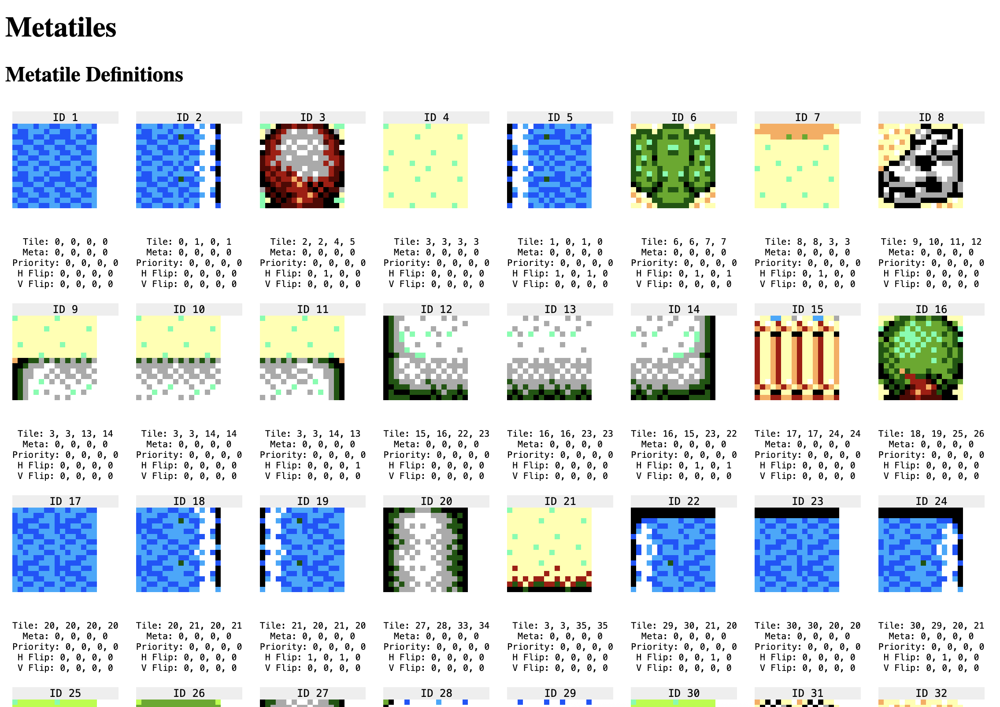

# tiled2gsl

Convert tiled document into meta tiles and scroll table to be used with [GSLib].

GSLib has a tool for this UGT, but I was having trouble with it and decided to attempt a rewrite.

## Usage 

_tiled2gsl_ exclusively provides a command line interface. 

Note: _tiled2gsl_ depends on [tileson], which only seems to support .tmj files, so users will need to "save as" → ".tmj" in Tiled. 

### Example

```sh
./tiled2gslib  --save-metatiles out/map_metatiles.bin --save-scrolltable out/map_scrolltable.bin --save-metatiles-doc index.html
```

outputs

```txt
Processing... ./examples/tiled/map.tmj
size: 128 x 128
metatile count: 65

Saved metatiles to: out/map_metatiles.bin
Saved scrolltable to: out/map_scrolltable.bin
Saved metatile html doc to: index.html
fin.
```

### Help doc

```txt
tiled2gslib - Convert a .tmj file for use with GSLib


./tiled2gslib [OPTIONS] input


POSITIONALS:
  input TEXT:FILE REQUIRED    Input file (.tmj)

OPTIONS:
  -h,     --help              Print this help message and exit
          --save-metatiles TEXT
                              Optional output file path for metatiles
          --save-scrolltable TEXT
                              Optional output file path for scrolltable
          --save-metatiles-doc TEXT
                              Optional output file path for metatile documentation
          --tile-layer TEXT   Tile layer name (default: GSLTileLayer)
          --priority-layer TEXT
                              Priority layer name (default: GSLPriorityLayer)
          --meta-layer TEXT   Meta layer name (default: GSLMetaLayer)
```

### Getting Metatile IDs

Instead of a fancy UI, tiled2gsl generates and HTML page to look up the metatile ids. This has the benefit of being able to search and zoom a bit better.

add the `--save-metatiles-doc some-path.html` flag to generate the document.

Screenshot:



## Why?

- UGT had a bug on mac/linux that required a workaround that I didn't like dealing with
- wanted to play with another development language
- wanted to try a project to see how much I could use AI to develop. This results are... mixed, at best.

## Limitations / Possible TODOs

- [ ] Image input - right now only input supported is .tmj
- [ ] Compress tileset image with PSGaiden, this seems sort of unnecessary as there are other tools for that.
- [ ] Anything to do with the palette.

## Building _tiled2gsl_

### Dependencies

| Dependency                                                     | Purpose      |
| -------------------------------------------------------------- | ------------ |
| [Zig]                                    | c++ compiler |
| [GNU make] | build tool   |

### Compile

```
make
```

[gslib]: https://github.com/sverx/GSLib
[gnu make]: https://www.gnu.org/software/make/manual/make.html
[tileson]: https://github.com/SSBMTonberry/tileson
[zig]: https://ziglang.org/